# Решение задач из книги "С++ Шаг за шагом"

## Модуль 4

---

#### Задание: Покажите, как объявить массив `hightemps` типа `short int` размером `31` элемент.

#### Решение:

```cpp
#include <iostream>

int main() {
    using namespace std;

    short int hightemps[31];
    
    cout << "Памяти выделено на " << sizeof(hightemps) / sizeof(short int) << " элементов.\n";

}
```

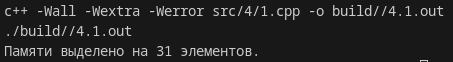


---

#### Задание:  Напишите проrpамму, которая просматривает массив из 10 целых чисел в поисках одинаковых значений. Все найденные пары программа должна выводить на экран.

#### Решение:
```cpp
#include "iostream"

int main() {

    using namespace std;

    int arr[10] = {1, 1, 2, 3, 2, 3, 7, 8, 9, 9};

    int cnt = 0;
    for (int i = 0; i < 10; ++i) {
        for (int j = i + 1; j < 10; ++j) {
            if (arr[i] == arr[j]) {
                cout << "Пара " << cnt << ": " << arr[i] << ", " << arr[j] << endl;
                cnt += 1;
            }
        }
    }
}
```

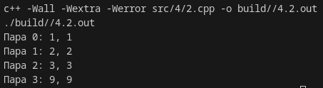

---

#### Задание:  Напишите проrpамму, которая запрашивает у пользователя двестроки, а затем сравнивает эти строки, не обращая внимания нареrистр букв. В этом случае `"ok"` и `"ОК"` будут считаться равными.

#### Решение:

```cpp
#include <iostream>
#include <string>

std::string toUp(std::string s) {
    std::string out = "";
    for (int i = 0; i < (int) s.length(); ++i) {
        out += toupper(s.at(i)); 
    }
    return out;
}

int main() {
    using namespace std;

    string s1, s2;

    cin >> s1 >> s2;

    cout << ((toUp(s1) == toUp(s2)) ? "same\n" : "different\n");
}
```

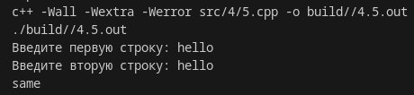

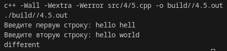

---

#### Задание: Покажите, как инициализировать массив nums типа int значениями `5`, `66` и `88`.

#### Решение:

```cpp
#include <iostream>

int main() {

    using namespace std;

    int arr[3] = {5, 66, 88};

    for (auto el : arr) {
        cout << el << endl;
    }

}
```

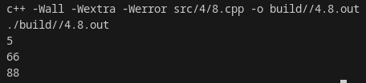

---

#### Задание: Напишите проrpамму, которая подсчитывает число прописныхбукв в строке и выводит результат на экран.

#### Решение:

```cpp
#include <iostream>
#include <string>
#include <cctype> // Для функции isupper

using namespace std;

int main() {
    string input;
    int uppercaseCount = 0;

    // Ввод строки
    cout << "Введите строку: ";
    getline(cin, input);

    // Подсчет заглавных букв
    for (char c : input) {
        if (isupper(static_cast<unsigned char>(c))) {
            ++uppercaseCount;
        }
    }

    // Вывод результата
    cout << "Количество прописных букв (больших): " << uppercaseCount << endl;

    return 0;
}
```

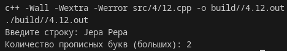

## Модуль 5

#### Задание: Создайте функцию hypot(), которая вычисляет rипотенузу прямоyrольноrо треyrольника по двум ero катетам.

#### Решение:

```cpp
#include <iostream>
#include <cmath>

using namespace std;

double hypot(double x1, double x2) {
    return sqrt(x1 * x1 + x2 * x2);
}

int main() {
    cout << "Египетский треугольник:\n";
    double x1 = 3., x2 = 4.;
    cout << "x1=" << x1 << ", x2=" << x2 << endl;
    cout << "hypot -> " << hypot(x1, x2) << endl;

}
```

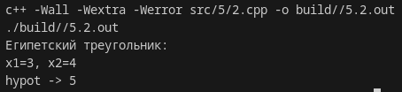

---

#### Задание: Создайте собственный вариант функции strlen() стандартной библиотеки.

#### Решение:

```cpp
#include <iostream>

using namespace std;

size_t custom_strlen(const char* str) {
    size_t length = 0;
    while (str[length] != '\0') {
        ++length;
    }
    return length;
}

int main() {
    const char* myString = "Hello, world!";
    size_t length = custom_strlen(myString);
    cout << "Длина строки \"" << myString << "\": " << length << endl;

    return 0;
}
```

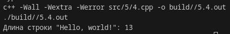

---

#### Задание: Создайте функцию byТbrees(), которая возвращает последовательностъ чисел, каждое из которых на 3 больше предыдущеrо.Создайте дрyryю функцию, reset( ), которая заставит byТhrees() начать создавать новую.

#### Решение:


```cpp
#include <iostream>

int current = 0;

int byThrees() {
    int result = current;
    current += 3; 
    return result;
}

void reset() {
    current = 0; 
}

int main() {
    // Демонстрация работы функций
    std::cout << "Последовательность byThrees(): ";
    for (int i = 0; i < 5; ++i) {
        std::cout << byThrees() << " ";
    }
    std::cout << std::endl;

    // Сброс последовательности
    reset();
    std::cout << "После сброса: ";
    for (int i = 0; i < 5; ++i) {
        std::cout << byThrees() << " ";
    }
    std::cout << std::endl;

    return 0;
}
```

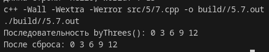

---

#### Задание: Напишите проrpамму, которая требует ввод пароля, указываемоrона командной строке. Ваша проrрамма может не выполнять никакой полезной работы, а только выводить сообщение, правильныйли пароль введен.

#### Решение:

```cpp
#include <iostream>
#include <string>

using namespace std;

int main(int argc, char* argv[]) {
    // Проверяем, передан ли аргумент командной строки
    if (argc != 2) {
        cerr << "Использование: " << argv[0] << " <пароль>" << endl;
        return 1;
    }

    const string correctPassword = "VolkNeTotKtoVoitAuf";
    string enteredPassword = argv[1];           

    if (enteredPassword == correctPassword) {
        cout << "Пароль верный." << endl;
    } else {
        cout << "Неверный пароль." << endl;
    }

    return 0;
}

```

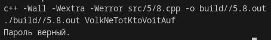


---

#### Задание: Напишите рекурсивную функцию, которая выводит числа от 1 до 10. Продемонстрируйте ее использование в проrpамме.

#### Решение:

```cpp
#include <iostream>

using namespace std;

void stupid_dupid_print(int n) {
    if (n == 1) {cout << 1 << endl; return;}
    cout << n << endl;
    stupid_dupid_print(n-1);
}

int main() {
    int num = 10;
    stupid_dupid_print(num);
}
```

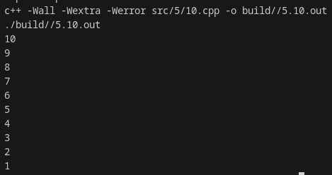

## Модуль 6

## Модуль 7

## Модуль 8

## Модуль 9

## Модуль 10

## Модуль 11

